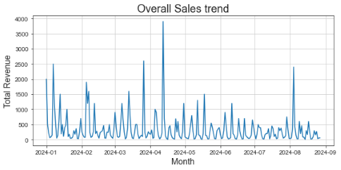
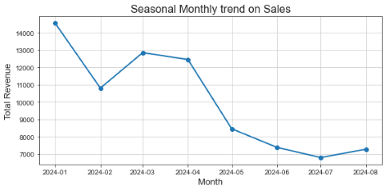
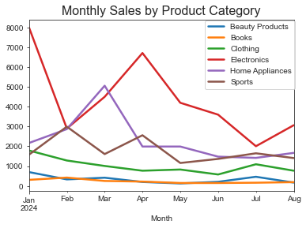
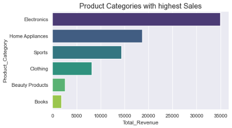
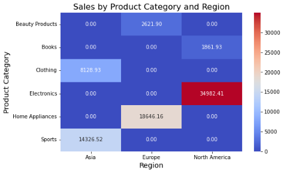
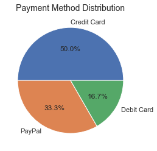
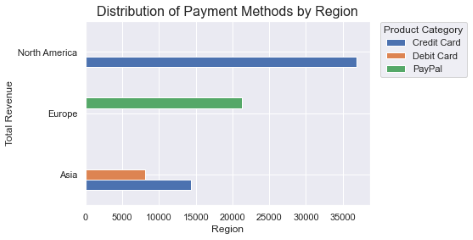

# Online Sales
The goal of this project is the analysis of the global online sales transactions across various products between January and August 2024. The project covers retrieving data from a database, data manipulation, visualizations and answering business questions.

## Overview
- Explored the SQLite database and retrieved data in a Pandas dataframe
- Aggregated Sales by Date and Month to evaluate the overall and seasonal monthly trends
- Created pivot table of monthly Sales by Product Category to explore the seasonal patterns of different products
- Grouped Sales by Payment Methods to see the most popular payment method by region
- Created pivot table of Sales by Region to find which are the most popular product categories in each region

## Resources Used
- SQLite3 module for creating, accesing and exploring the database
- Python 3.7
- Numpy and Pandas libraries for data manipulation
- Matplotlib and Seaborn libraries for data visualization

## Dataset
The Online Sales dataset was obtained from [Kaggle](https://www.kaggle.com/datasets/shreyanshverma27/online-sales-dataset-popular-marketplace-data). Each entry contains information about a single transaction:

- Transaction ID: Unique identifier for each sales order.
- Date: Date of the sales transaction.
- Product Category: Broad category of the product sold (e.g., Electronics, Home Appliances etc.).
- Product Name: Specific name or model of the product sold.
- Units Sold: Number of units of the product sold in the transaction.
- Unit Price: Price of one unit of the product.
- Total Revenue: Total revenue generated from the sales transaction (Quantity * Unit Price).
- Region: Geographic region where the transaction occurred (e.g., North America, Europe, Asia).
- Payment Method: Method used for payment (e.g., Credit Card, PayPal, Debit Card).

## Data Preparation
I followed the next steps for creating new variables and aggregating data:

-  Retrieve data from the SQLite database into a Pandas dataframe
-  Check for missing values and duplicate rows
-  Convert Date to datetime
-  Made a new column for Month
-  Created a pivot table of monthly sales for each product category to analyze the seasonal patterns of different product categories
- Aggregate Total Revenue by:
     - Date to see the overall sales trend for the entire period
     - Month to obtain the seasonal monthly trend on sales
     - Product Category to find the product categories with the highest sales
     - Region to see which region has the highest sales
     - Payment Methods and Region to obtain the distribution of payment methods by region
- Created a pivot table of sales by product categories and region to find which is the most popular payment method by region

## Exploratory Analysis
I used data visualizations to answer the following questions:

### What are the monthly sales?

The **overall sales trend** fluctuated over the entire time span from January to August 2024, reaching the highest point in April. 

 

The **monthly trend** shows a decline in sales in January, followed by a good increase between February and April. Then, it continues to decrease to the lowest point in July then start to pick up again in August.

 

The plot of the **pivot table of monthly sales for each product category** show that **Electronics** sales reached a peak in April and **Home Appliances** in March. **Sports** sales reached the highest values in February, then again in April. They all decreased until August. The sales for **Clothing**, **Books** and **Beauty Products** remained almost constant for all the months.

 

### Which product categories have the highest sales?

The **highest sales** come from **Electronics**, followed by **Home Appliances** and **Sports**, while **Clothing**, **Beauty Products**, and **Books** make up for **smaller proportions**.

 

 We are also interested to see which are the **top Units Sold by Product Category**.

 
 
 The **top** number of **Units Sold** are for **Clothing**, followed by **Sports**. A smaller number of units sold are for Home Appliances and Electronics.
 

### Which product categories are most popular in each region?

The **heatmap** below shows that the **highest sales volume** comes from **Electronics** in **North America**, followed by **Home Appliances** in **Europe** and
**Sports** in **Asia**. Other popular products are **Clothing** in **Asia**, **Beauty Products** in **Europe** and **Books** in **North America**.

 

### What is the distribution of Payment Methods?

It can be observed that the **highest revenue** comes from using **Credit Cards (50%)**, followed by **PayPal(33.3%)** and **Debit Card (16.7%)

 

The **most used payment method** in **North America** is **Credit Card**, followed by **Europe** where is **mostly** used **PayPal**. **Asia** is the only region where are used **two payment methods, Credit and Debit Cards**.

 

